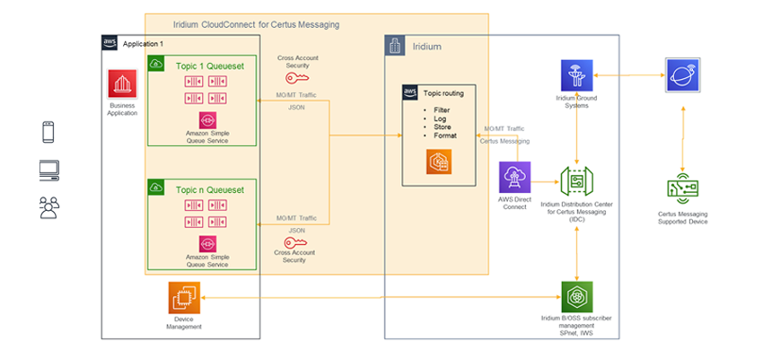
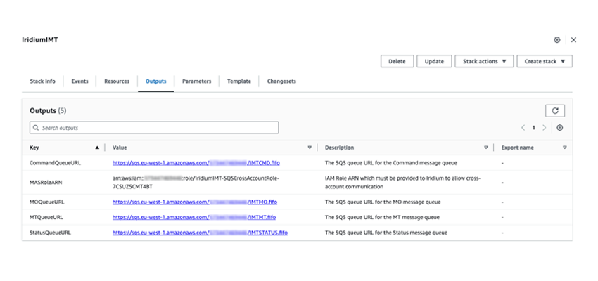
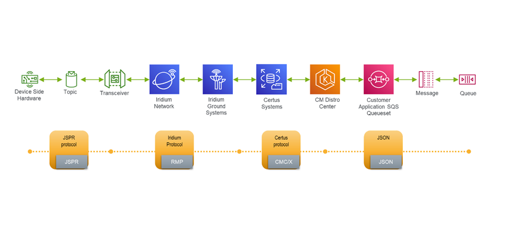

# Iridium CloudConnect for IMT on AWS Guide

### Table of Contents

- [Overview](#overview)
  - [Costs and licenses](#costs-and-licenses)
  - [Architecture](#architecture)
- [Deployment](#deployment)
  - [Pre deployment steps](#pre-deployment-steps)
  - [Iridium partner or customer](#iridium-partner-or-customer)
  - [Deployment steps](#deployment-steps)
  - [Post deployment steps](#post-deployment-steps)
    - [Interacting with your Amazon SQS queues](#interacting-with-your-amazon-sqs-queues)
    - [Receiving mobile-originated messages](#receiving-mobile-originated-messages)
    - [Sending mobile-terminated messages](#sending-mobile-terminated-messages)
      1. [Sending](#1---sending)
      2. [Polling the confirmation message queue](#2---polling-the-confirmation-message-queue)
- [Provisioning](#provisioning)
- [Data format](#data-format)
  - [CRC](#crc)
  - [MO Message](#mo-message)
  - [MT Message](#mt-message)
  - [Status message](#status-message)

## Overview

This guide contains step-by-step instructions for deploying the Iridium CloudConnect with devices powered by Iridium Messaging Transport℠ (IMT℠) on an existing AWS account.

The guide is for Iridium users that want to deploy Iridium CloudConnect into their AWS account and establish cross-account permissions for Iridium CloudConnect to access Amazon Simple Queue Service (Amazon SQS) queues to store and retrieve messages.

You can read more about [Iridium Messaging Transport](https://www.iridium.com/services/iridium-messaging-transport/) by visiting the service description page hosted in Iridiums website.

## Costs and licenses

There is no cost to use this guide, but you will be billed for any AWS services or resources that this guide deploys.

Iridium charges fees for messages, satellite network usage, and infrastructure setup, subject to applicable license agreements and terms and conditions with Iridium. Contact your Iridium representative, VAR, or service provider for details.

## Architecture



<sub><sup>Figure 1. Architecture for Iridium CloudConnect on AWS</sup></sub>

As shown in Figure 1, this guide deploys a CloudFormation template that sets up the following:

1. A set of Amazon SQS queus to provide a highly available queueing service for messages coming from Iridium IMT. This deployment configures the following queues:

- The Mobile Originated `IMTMO.fifo` SQS queue where MO messages will be deposited
- The Mobile-Terminated `IMTMT.fifo` SQS queue where MT messages will be deposited
- The `IMTSTATUS.fifo` SQS queue where MT and MO message status, and Command message status messages will be deposited
- The `IMTCMD.fifo` SQS queue where MT command messages will be deposited

2. An AWS Identity and Access Management (IAM) role and policy to set up Iridium CloudConnect cross-account authentication.

## Deployment

Deploy this AWS CloudFormation template in your account:

[Iridium Messaging Transport CloudConnect customer CloudFormation template for creating SQS queues and cross-account permission for IMT to access the queues. Last updated 2022-07-02"](template/iridium-cloud-connect-imt.template.yaml)

## Pre deployment steps

### Iridium partner or customer 

If you are not already an Iridium partner or customer, navigate to [Iridium](http://www.iridium.com) to learn more. Existing Iridium customers that are not direct Iridium Value-Added Retailers (VARs) should inquire with their service provider if Iridium CloudConnect is available. Iridium maintains a list of approved Iridium CloudConnect service providers. For more information, see [Who's My Service Provider?](https://www.iridium.com/who-is-my-sp/) on Iridium's website.

## Deployment steps

1. Sign in to your AWS account, open the AWS CloudFormation console and load the template located under the `template` folder of this guide.

2. Choose the correct AWS Region, and then choose **Next**.

3. On the Create stack page, keep the default setting and then choose Next.

4. On the Specify stack details page, change the stack name if needed. Review the parameters for the template. Provide values for the parameters that require input. For all other parameters, review the default settings and customize them as necessary. When you finish reviewing and customizing the parameters, choose Next.

5. On the Configure stack options page, you can specify tags (key-value pairs) for resources in your stack and set advanced options. When you finish, choose Next.

6. On the Review page, review and confirm the template settings. Under Capabilities, select all of the check boxes to acknowledge that the template creates AWS Identity and Access Management (IAM) resources that might require the ability to automatically expand macros.

7. Choose Create stack. The stack takes about 10 minutes to deploy.

8. Monitor the stack’s status, and when the status is `CREATE_COMPLETE`, the deployment is ready.

9. To view the created resources, choose the Outputs tab.




<sub><sup>Figure 2. AWS CloudFormation template outputs</sup></sub>

## Post deployment steps

### Interacting with your Amazon SQS queues

AWS provides several ways to interact with Iridium CloudConnect SBD queues, including:

- Via the command line, using the AWS Command Line Interface (AWS CLI).

- Manually, by navigating to Amazon SQS queues in the AWS Management Console.

- Programmatically, with many libraries available, such as: Boto3 for Python, AWS SDK for .NET, AWS SDK for Java and AWS SDK for Ruby

### Receiving mobile-originated messages

The recommended approach for receiving mobile-originated (MO) messages is to long-poll the `IMTMO.fifo` queue. After messages are received, save them in your database to process the messages, and then delete the messages.

**Note:** As a precaution in case of connectivity issues, Amazon SQS doesn’t automatically delete messages when they’re received. To delete a message, you must send a separate request after receiving it. For more information, see [Receiving and deleting messages (console)](https://docs.aws.amazon.com/AWSSimpleQueueService/latest/SQSDeveloperGuide/step-receive-delete-message.html).

```python

# Example message payload
#
# {
#     "billingReference":"54560a24-a9a6-41e6-b158-cf04d246d4a0",
#     "cmid":"9771000205022",
#     "messageId":4,
#     "originatorCrcError":false,
#     "payload":"Q2xvdWR5IHdpdGggc3VubnkgaW50ZXJ2YWxzLgpMbw==",
#     "topicId":179
# }


# Get the service resource
sqs = boto3.resource('sqs')

# Get the queue
queue = sqs.get_queue_by_name(QueueName='IMTMO.fifo')

# Process messages by printing out cmid,topicId,messageId,originatorCrcError,and payload
for message in queue.receive_messages(WaitTimeSeconds=30):

    data = {}
    data['billingReference'] = None
    data['cmid'] = None
    data['topicId'] = None
    data['messageId'] = None
    data['payload'] = None
    data['originatorCrcError'] = None

    data_dic = json.loads(message.body)

    data['billingReference'] = data_dic['billingReference']
    data['cmid'] = data_dic['cmid']
    data['topicId'] = data_dic['topicId']
    data['messageId'] = data_dic['messageId']
    data['payload'] = data_dic['payload']
    data['originatorCrcError'] = data_dic['originatorCrcError']


    # Do something with data or data_dic (i.e save message on a database)

    # Let the queue know that the message is processed

    message.delete()

```

### Sending mobile-terminated messages

Mobile-terminated messages (MT) are sent asynchronously. Therefore, when establishing a management process for MT messages, it is recommended that you break the process down into two separate procedures: (1) sending, and (2) polling the confirmation message queue.

#### 1 - Sending

When sending MT messages, identify each message with a globally-unique request reference, and send the message to the `IMTMT.fifo` queue. Additional parameters can be used to prevent duplicate messages. For example:

```python
import boto3
import json
import uuid

# Get the service resource
sqs = boto3.resource('sqs')
# Get the queues
mt_queue = sqs.get_queue_by_name(QueueName = 'IMTMT.fifo ')

# Create a message
body = {
    "cmid": "123456789012345",
    "topicId": 567,
    "requestReference": "f81d4fae-7dec-11d0-a765-00a0c91e6bf6", # globally unique
    "ringStyle": "none",
    "payload": "Q2xvdWR5IHdpdGggc3VubnkgaW50ZXJ2YWxzLgpMbw==",
    "index" : 0
}

# Additional paremetners to prevent unnecessary redundancy

deduplication_id = str(uuid.uuid4())
group_id = str(uuid.uuid4())

mt_queue.send_message(
    MessageBody = json.dumps(body),
    MessageGroupId = group_id,
    MessageDeduplicationId = deduplication_id
)

# Do something (i.e. mark "message sent" in the database)


```

#### 2 - Polling the confirmation message queue

When polling the `ICC_CM_STATUS.fifo` queue for confirmation messages, process each confirmation message and then delete it. For example:


```python
# Get the service resource
sqs = boto3.resource('sqs')

# Get the queues
mt_status_queue = sqs.get_queue_by_name(QueueName='IMTSTATUS.fifo')

for message in mt_status_queue.receive_messages(WaitTimeSeconds=30):

    data = json.loads(message.body)

    # Status is used to indicate MT message delivery success or failure
    # Status message reports on the delivery status of an MT message

    if data['mtMessageStatus']['deliveryStatus'] == "success":
        print('Message {0} is queued for delivery to cmid {1} in topicId {2}'.format(
            data['cmid'],
            data['topicId'],
            data['messageId'],
            data['requestReference'],
            data['messagePending'],
            data['deliveryStatus']
        ))

        # Do something (i.e mark the message as "processed")

    else:
        print('Message {0} was not sent to cmid {1}'.format(
            data['topicId'],
            data['cmid']
        ))

# Let the queue know that the message is processed
message.delete()


```

<!-- TODO #### Polling the error message queue -->

### Provisioning

Devices must be provisioned using Iridium SPNet or Iridium Web Services (IWS). IMT Topics are associated with the SQS queuesets. Devices are subscribed to Topics using the SPnet and IWS interfaces. Please see the SPnet/IWS developer and user guides for more information.

### Data format

When Iridium CloudConnect processes data from your device, it puts it in a JSON object that is exchanged between Amazon SQS and the Iridium gateway through Iridium CloudConnect.

JSON specification for IMT was developed to include payload and header information and follows the schema specification provided in the next sections. Full details of the IMT schema variables are provided bellow.

#### CRC

IMT uses CRC to validate MO messages when processed from the customer MO SQS queue. Additionally, MT messages are validated on the device side for correct CRC.

Each MO and MT message includes the 16-bit or two octet CRC defined below as part of the payload prior to Base64 encoding. The CRC is appended MSB first. The CRC definition is:

```c
width=16
poly=0x1021
init=0x0000
refin=false
refout=false
xorout=0x0000
check=0x31c3
residue=0x0000
```

The CRC is CRC-16/XMODEM, which can be found in the CRC catalog at https://reveng.sourceforge.io/crc-catalogue/all.htm with references to the relevant standards.

As a test vector, the 16-bit CRC calculated for the 72-bit input string '123456789' concatenated with 8 bits of zero is 0x31c3. Another CRC calculated for the same 72-bit input string concatenated with 0x31c3 should result in a 16-bit CRC of all zeros.


```python
from crc16 import crc16xmodem
from binascii import ( unhexlify, hexlify )
from base64 import b64encode

# Oginal message, up to 100 KiB
mt_payload = "Cloudy with sunny intervals.\n".encode()
print(mt_payload)
# Calculate the message CRC
mt_payload_crc = f"{crc16xmodem(mt_payload):#0{6}x}"[2:]

# Append CRC to message
mt_payload_with_crc = unhexlify(hexlify(mt_payload).decode() + mt_payload_crc)

# Base64 encode message
mt_payload_with_crc_b64 = b64encode(mt_payload_with_crc).decode()

print(mt_payload_with_crc_b64)

# Q2xvdWR5IHdpdGggc3VubnkgaW50ZXJ2YWxzLgpMbw==

```

#### MO Message

Iridium Message Transport MO JSON schema:

```json
{
    "$id": "https://iridium.com/mo.certus.message.json",
    "$schema": "http://json-schema.org/draft-07/schema#",
    "type": "object",
    "title": "MO Message",
    "description": "A mobile originated message passed from CM Service Connector to MAS.",
    "required": [ "cmid", "topicId", "messageId", "payload", "originatorCrcError" ],
    "properties":
    {
        "cmid":
        {
            "$ref": "#/definitions/cmid"
        },
        "topicId":
        {
            "$ref": "#/definitions/topicId"
        },
        "messageId":
        {
            "$ref": "#/definitions/messageId"
        },
        "billingReference":
        {
            "type": "string",
            "description": "Billing reference."
        },
        "payload":
        {
            "type": "string",
            "description": "Contents of the message, including CRC."
        },
        "originatorCrcError":
        {
            "type": "boolean",
            "description": "True for user supplied CRC error"
        }
    },
    "definitions": {
        "cmid": {
            "type": "string",
            "minLength": 1,
            "maxLength": 15,
            "pattern": "^[0-9]{1,15}$",
            "description": "ID of IMT subscriber."
        },
        "messageId":
        {
            "type": "integer",
            "minimum": 0,
            "maximum": 255,
            "description": "ID of this message assigned by the transceiver."
        },
        "topicId":
        {
            "type": "integer",
            "minimum": 0,
            "maximum": 65535,
            "description": "Globally unique topic indentifier."
        }
    }
}

```

**Note:** See the Iridium Messaging Transport Developer’s Guide for more information about message specifications.

Example MO message

```json
{
	"cmid": "123456789012345",
	"topicId": 567,
	"messageId": 201,
	"payload": "U2VuZCB3ZWF0aGVyIHRvbW9ycm93LgVo=",
	"originatorCrcError": false,
}
```

**Note:** For field details, see the following tables.

Top-level MO keys

| Field                 | Description |
| --------              | ------- |
| cmid  | IMT Identity of the subscriber   |
| topicId             | Globally unique topic identifier. This is used for selecting the MAS to receive the message and the Queue Set to put it on. A MAS may accept messages on multiple topics on different Queue Sets.    |
| messageId               | MO message identifier, assigned at the transceiver. |
| billingReference           | The billing reference for the message will be included if it has been assigned.    |
| payload           | Base 64 encoded message data.    |
| originatorCrcError           | Set to 'true' if a CRC error was detected on the original message before transmission    |


#### MT Message

Iridium Message Transport MT JSON schema:


```json
{
    "$id": "https://iridium.com/mt.certus.message.json",
    "$schema": "http://json-schema.org/draft-07/schema#",
    "type": "object",
    "title": "MT Message",
    "description": "A mobile terminated message passed from MAS to CM Service Connector.",
    "required": [ "cmid", "topicId", "requestReference", "ringStyle", "payload"],
    "properties":
    {
        "cmid":
        {
            "$ref": "#/definitions/cmid"
        },
        "topicId":
        {
            "$ref": "#/definitions/topicId"
        },
        "requestReference":
        {
            "type": "string",
            "description": "MAS GUID reference for this message."
        },
        "ringStyle":
        {
            "type": "string",
            "description": "Ring retry mechanism.",
            "enum": [ "none", "normal", "urgent", "extended" ]
        },
        "payload":
        {
            "type": "string",
            "description": "Contents of the message with appended 2-byte CRC, Base64 encoded. CRC is in format of CRC-16 CCITT (XMODEM)"
        }
    },
    "definitions": {
        "cmid": {
            "type": "string",
            "minLength": 1,
            "maxLength": 15,
            "pattern": "^[0-9]{1,15}$",
            "description": "ID of IMT subscriber."
        },
        "topicId":
        {
            "type": "integer",
            "minimum": 0,
            "maximum": 65535,
            "description": "Globally unique topic identifier."
        }
    }
}
```

Example MT message:


```json
{
	"cmid": "123456789012345",
	"topicId": 567,
	"requestReference": "f81d4fae-7dec-11d0-a765-00a0c91e6bf6",
	"ringStyle": "none",
	"payload": "Q2xvdWR5IHdpdGggc3VubnkgaW50ZXJ2YWxzLgpMbw==",
    "index" : 0
}
```


Top-level MT keys

| Field                 | Description |
| --------              | ------- |
| cmid  | IMT Identity of the subscriber   |
| topicId             | Globally unique topic identifier for routing to the subscribed field devices.    |
| requestReference               | Globally unique request ID used in the corresponding Status message. The value needs to be unique amongst all outstanding messages on a Queue Set. The format of this field is defined as per RFC4122. |
| ringStyle           | Ring retry pattern for the message. If “none”, the subscribed user will not be rung, and the message will be queued for transmission until a connection is established for another reason. “normal” = 1 ring cycle, “urgent” = 2 ring cycles with a short gap between them, “extended” = 2 ring cycles with a longer gap between them.    |
| payload           | Payload with the last 2 bytes being the CRC, all base 64 encoded. See Section 5.2.1 for CRC calculation.    |


#### Status message

Iridium Message Transport Status JSON schema:

```json
{
    "$id": "https://iridium.com/status.certus.message.json",
    "$schema": "http://json-schema.org/draft-07/schema#",
    "title": "Status Queue Message",
    "anyOf":
    [
        {"required": ["mtMessageStatus"]},
        {"required": ["moMessageStatus"]}
    ],
    "properties":
    {
        "mtMessageStatus": { "$ref": "#/definitions/mtStatus"},
        "moMessageStatus": { "$ref": "#/definitions/moStatus"}
    },
    "additionalProperties": false,
    "definitions":
    {
        "cmid":
        {
            "type": "string",
            "minLength": 1,
            "maxLength": 15,
            "pattern": "^[0-9]{1,15}$",
            "description": "ID of IMT subscriber."
        },
        "messageId":
        {
            "type": "integer",
            "minimum": 0,
            "maximum": 255,
            "description": "ID of this message assigned by the transceiver."
        },
        "topicId":
        {
            "type": "integer",
            "minimum": 0,
            "maximum": 65535,
            "description": "Globally unique topic indentifier."
        },
        "mtStatus":
        {
            "type": "object",
            "description": "A status report for an MT message.",
            "properties":
            {
                "cmid":
                {
                    "$ref": "#/definitions/cmid"
                },
                "topicId":
                {
                    "$ref": "#/definitions/topicId"
                },
                "messageId":
                {
                    "$ref": "#/definitions/messageId"
                },
                "requestReference":
                {
                    "type": "string",
                    "description": "MAS GUID reference for this message."
                },
                "messagePending":
                {
                    "type": "boolean",
                    "description": "The message is still pending delivery yes/no."
                },
                "deliveryStatus":
                {
                    "$ref": "#/definitions/mtDeliveryStatus"
                },
                "additionalDetails":
                {
                    "type": "string",
                    "description": "Additional details dependent upon deliveryStatus."
                }
            },
            "if": {
                "properties":
				{
					"deliveryStatus":
					{
						"const": "malformed_json"
					}
				}
            },
            "then": {
                "required": ["deliveryStatus", "additionalDetails", "messagePending"]
            },
            "else":
			{
                "required": ["cmid", "topicId", "requestReference", "messagePending","deliveryStatus"]
            },
            "additionalProperties": false
        },
        "mtDeliveryStatus":
        {
            "type": "string",
            "description": "Status of message, success or error code.",
            "enum": [ "success", "message_discarded_on_overflow", "message_expired", "message_timed_out", "message_cancelled", "unprovisioned", "subscription_invalid", "topic_invalid", "no_response_to_ring", "not_registered", "message_failed", "crc_error_in_transfer", "local_crc_error", "delayed_access", "service_disabled", "registration_expired", "malformed_json"]
        },
        "moStatus":
        {
            "type": "object",
            "description": "A status report for an undelivered MO message.",
            "required": [ "cmid", "topicId", "deliveryStatus" ],
            "properties":
            {
                "cmid":
                {
                    "$ref": "#/definitions/cmid"
                },
                "topicId":
                {
                    "type": "integer",
                    "description": "Globally unique topic identifier."
                },
                "messageId":
                {
                    "type": "integer",
                    "description": "Message ID if allocated."
                },
                "deliveryStatus":
                {
                    "$ref": "#/definitions/moDeliveryStatus"
                }
            },
            "additionalProperties": false
        },
        "moDeliveryStatus":
        {
            "type": "string",
            "description": "Status of message.",
            "enum": [ "transfer_timeout", "originator_failure", "message_cancelled", "unprovisioned", "invalid_subscription", "crc_error_in_transfer", "protocol_error", "message_failed" ]
        }
    }
}
```


Top-level Status keys

MT Message Status Keys

| Field                 | Description |
| --------              | ------- |
| cmid  | Same as the corresponding MT message.   |
| topicId  | Globally unique topic identifier copied from the corresponding MT message.   |
| messageId  | The MT message identifier of the message, if it has been allocated.  |
| requestReference  | Request ID copied from the corresponding MT message   |
| messagePending  | If true, then this message is pending delivery and the IDC will send further MT Message Status messages when the delivery status changes. If false, then this is the final MT Message Status message for the corresponding request.   |
| deliveryStatus  | For pending messages, this field indicates why the message cannot be immediately delivered. For non-pending messages, this field give a final delivery status: success or error condition.   |
| additionalDetails  | A non-mandatory field dependent upon the delivery status code. Details in delivery status codes below.   |

MO Message Status Keys


| Field                 | Description |
| --------              | ------- |
| cmid  | CMID that sent the MO message.   |
| topicId  | Globally unique topic identifier copied from the corresponding MO message.   |
| messageId  | The MO message identifier of the message, if it has been allocated.   |
| deliveryStatus  | Delivery error condition.   |

MO Message Status Error codes


| Error code                 | Description |
| --------              | ------- |
| transfer_timeout  | An MO message timed out during tanser.   |
| originator_failure  | The SE failed to correctly supply the message. |
| message_cancelled  | MO message cancelled by SE.  |
| unprovisioned  | Not provisioning for Iridium Messaging Transport.   |
| invalid_subscription  | SE not subscribed to the topic.  |
| crc_error_in_transfer  | The MO message CRC is incorrect.   |
| protocol_error  | MO message lost due to IDCP failover.  |
| message_failed  | SE reset during MO message transfer.  |


Command message


Iridium Message Transport Command JSON schema:

```json


{
    "$id": "https://iridium.com/mtcommand.certus.message.json",
    "$schema": "http://json-schema.org/draft-07/schema#",
    "title": "Command Queue Message",
    "anyOf":
    [
        {"required":["mtCancelMessage"]}
    ],
    "properties":
    {
        "mtCancelMessage": {"$ref": "#/definitions/mtCancel"}
    },
    "additionalProperties": false,
    "definitions":
    {
        "cmid":
        {
            "type": "string",
            "minLength": 1,
            "maxLength": 15,
            "pattern": "^[0-9]{1,15}$",
            "description": "ID of IMT subscriber."
        },
        "topicId":
        {
            "type": "integer",
            "minimum": 0,
            "maximum": 65535,
            "description": "Globally unique topic indentifier."
        },
        "mtCancel":
        {
            "type": "object",
            "description": "An MT Message cancel command.",
            "required": ["cmid", "topicId", "requestReference"],
            "properties":
            {
                "cmid":
                {
                    "$ref": "#/definitions/cmid"
                },
                "topicId":
                {
                    "$ref": "#/definitions/topicId"
                },
                "requestReference":
                {
                    "type": "string",
                    "description": "MAS GUID reference for the message to cancel."
                }
            },
            "additionalProperties": false
        }
    }
}

```

Top-level Command keys

Command Message Keys

| Field               | Description |
| --------              | ------- |
| cmid  | CMID to which the MT message was sent.   |
| topicId  |Globally unique topic identifier copied from the corresponding MT message. |
| requestReference  | Request ID copied from the corresponding MT message.  |


## About Iiridium Message Transport (IMT)

Iridium Messaging Transport makes use of Topics to handles messages across the end-end system.



<sub><sup>Figure 3. Architecture for Iridium CloudConnect for IMT on AWS</sup></sub>

Topics are elements used to transmit and receive data via IMT. Each topic has its own 'address' that is tied to a specific Application Provider. The 'address' is known as a server-side topic that sits within an Application Server. For IMT, the Application Server SQS queuesets/hubs are used to support the use of Topics. Messages are routed to individual Topics based on message and topic configuration.

**Note:** Individual devices are allowed to subscribe to up to 25 different Topics.

Each Topic has an associated priority (H, M, L), a queue depth, and a Time to Live (TTL). These parameters are set up during provisioning (also see [Iridium provisioning document].)

A Topic’s priority, queue depth, and TTL are available (read-only) at the device side API interface.

In the Mobile Terminated direction, a server-side message is routed using the combination of a cmid and a topicId and published by the Application to the MT SQS queue associated with the Topic.

A device-side message is routed by publishing it to the topic send queue using the firmware JSPR command.

### IMT Messages

Messages payloads may be of any size between 1 and 100,000 bytes. Messages are served by priority (H to L) and then First Come-First Served within a priority. Messages are queued up to a depth, and then discarded according to a 'discard oldest' strategy. Messages are discarded if they are not transferred after the Time to Live (TTL) expires.

On the device side, messages may be individually queued with a 'delayed transfer' flag (optional) that allows the transceiver to optimize transfer times (e.g., by waiting for high quality signal levels and avoiding congested time periods).

### The application provider’s role

Application providers are responsible for defining Topics and creating the Application Server Queuesets associated with Topics.

## Troubleshooting

### Fequently Asked Questions (FAQ)

**Q. What is the pricing for Iridium CloudConnect? Who pays for the AWS compute resources?**

A. Iridium is currently not assessing a usage charge for sending messages through Iridium CloudConnect.

**Q. How do you ensure message ordering? Do you use Amazon SQS FIFO (First-In-First-Out)?.**

A. Iridium processes messages from the IMT gateway in order of receipt but does not specifically use an AWS Lambda instance for it. During the setup of Iridium CloudConnect, customers can choose FIFO or non-FIFO configurations. FIFO queues will keep messages in order.

# Customer responsibility

After you deploy this solution, confirm that your resources and services are updated and configured—including any required patches—to meet your security and other needs. For more information, refer to the [Shared Responsibility Model](https://aws.amazon.com/compliance/shared-responsibility-model).

## Feedback

To submit feature ideas and report bugs, use the Issues section of the GitHub repository.

## Notices

This document is provided for informational purposes only. It represents current AWS product offerings and practices as of the date of issue of this document, which are subject to change without notice. Customers are responsible for making their own independent assessment of the information in this document and any use of AWS products or services, each of which is provided "as is" without warranty of any kind, whether expressed or implied. This document does not create any warranties, representations, contractual commitments, conditions, or assurances from AWS, its affiliates, suppliers, or licensors. The responsibilities and liabilities of AWS to its customers are controlled by AWS agreements, and this document is not part of, nor does it modify, any agreement between AWS and its customers.