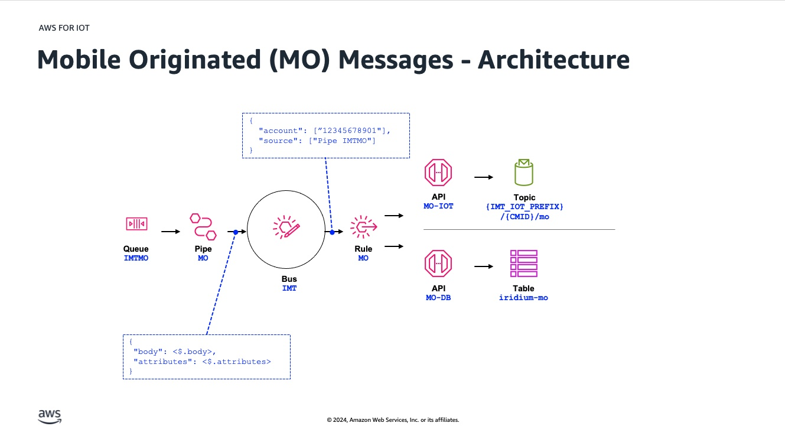
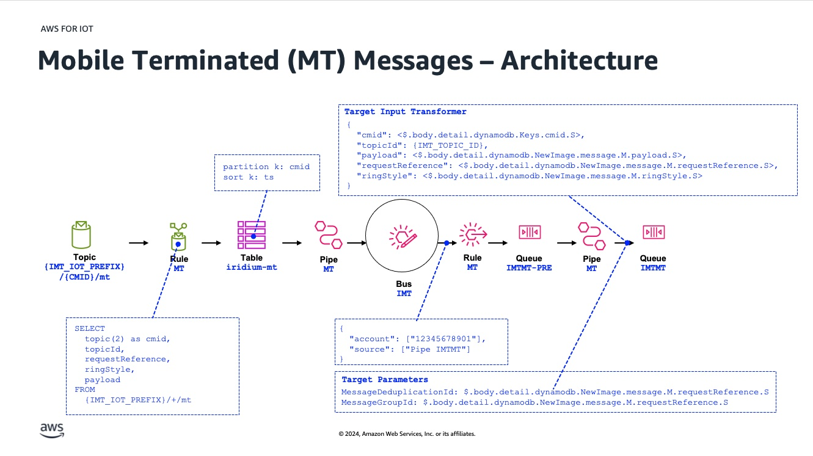
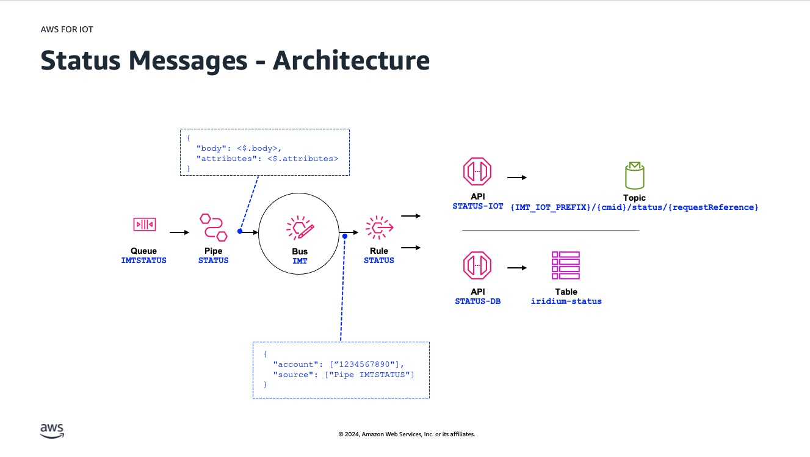

### Project Overview

The Iridium Messaging Transport (IMT) CloudConnect With Amazon EventBridge project aims to facilitate communication between IoT devices using Iridium satellites and other services hosted in AWS. It leverages AWS services to handle, route and process data transmitted from and to remote IoT devices via satellite.

> You can download this [slide deck](docs/slides.pdf). The slides were presented at the Iridium Partner Conference in March 2025. It covers the basic architecture, how to use AWS services to enable basic messaging functionality and AWS developer tools to automate infrastructure deployments.

### Key Components

1. **Amazon SQS**: Communication interface between your AWS Account and Iridium CloudConenct.

2. **Amazon EventBridge Bus**: Routes events to various AWS services based on rules.

3. **Amazon EventBridge Pipes**: Simplifies the integration of event sources and various targets.

4. **AWS IoT Core**: Managed service with message broker capabilities to send and receive messages using MQTT or HTTP

5. **Amazon DynamoDB**: Manage storage service that keeps track of all incoming and outgoing messages

6. **Amazon API Gateway**: Access interaface for applications to access data, business logic, or functionality from other services

### Architecture

Mobile Originated (MO) messages are initially placed in the (`IMTMO.fifo`) SQS queue and then passed through a processing pipe before entering the IMT EventBridge event bus. An event rule evaluates these messages and routes them to appropriate targets: either an IoT topic for further processing or to a DynamoDB table for storage. The messages consist of a body and associated attributes, ensuring they are properly processed, routed, and stored within the AWS environment.



Mobile Terminated (MT) messages are initially sent to a specific IoT topic (`{IMT_IOT_PREFIX}/{CMID}/mt`) and then evaluated by a rule that selects relevant fields like `cmid`, `topicId`, `requestReference`, `ringStyle`, and `payload`. These messages are stored in a DynamoDB table (`iridium-mt`) with `cmid` as the partition key and `ts` as the sort key. The messages then pass through an MT processing pipe to the IMT event bus, where they are routed by an event rule to a pre-processing queue (`IMTMT-PRE`). From there, the messages go through another MT pipe and finally reach the destination queue (`IMTMT.fifo`). The architecture includes a target input transformer to structure the message data and ensure that it is correctly formatted and enriched for processing and routing.



Status messages originate in the IMTSTATUS SQS queue and are processed through a STATUS pipe before reaching the IMT EventBridge bus. An event rule evaluates these messages and routes them to specific targets based on the content. Two targets: the STATUS-IOT API, which sends messages to an IoT topic formatted as `{IMT_IOT_PREFIX}/{cmid}/status/{requestReference}`, and the STATUS-DB API, which stores the messages in the DynamoDB table `iridium-status`. The architecture includes transforming the message body and attributes before routing, ensuring messages are correctly processed and stored for subsequent access and analysis.



### Prerequisites

1. **AWS Account**: Ensure you have an AWS account configured. You can sign up for an account at [aws.amazon.com](https://aws.amazon.com/).

2. **Iridium Message Transport (IMT) Queueset deployed**: You must have deployed the followin queue set before deploying this project:

- `IMTMO.fifo`
- `IMTMT.fifo`
- `IMTSTATUS.fifo`
- `IMTCMD.fifo` (not currently used for this project)

  Please visit [Iridium CloudConnect for IMT on AWS Guide
  ](https://github.com/aws-samples/aws-iot-iridium-satellite/blob/main/imt-getting-started/README.md) for a step-by-step instructions for deploying the Iridium CloudConnect with devices powered by Iridium Messaging Transport℠ (IMT℠) on an existing AWS account.

2. **AWS CLI**: Install and configure the AWS Command Line Interface (CLI).

   ```sh
   pip install awscli
   aws configure
   ```

3. **Node.js and NPM**: AWS CDK requires Node.js (>= 10.3.0) and NPM.

   - [Download and install Node.js](https://nodejs.org/).

4. **Python**: Install Python (>= 3.6). It's recommended to use a virtual environment.

   ```sh
   python3 -m venv .env
   source .env/bin/activate
   ```

5. **AWS CDK Toolkit**: Install the AWS CDK Toolkit via NPM globally.

   ```sh
   npm install -g aws-cdk
   ```

### Deploying the CDK Project

1. **Clone the new CDK project**:

   ```sh
   git clone https://github.com/aws-samples/aws-iot-iridium-satellite

   cd aws-iot-iridium-satellite/imt-iridium-cloudconnect-with-eventbridge/imt-cloudconnet-eventbridge
   ```

2. **Install project dependencies**:
   In the project directory, you will have a `requirements.txt` file. Install the dependencies listed.

   ```sh
   pip install -r requirements.txt
   ```

3. **Bootstrap the environment** (if not done already):

   ```sh
   cdk bootstrap
   ```

4. **Define enviroment variables for this project**:

   Set environment variables necessary for configuring an AWS-based application. These include specifying the AWS IoT endpoint subdomain (`IMT_IOT_SUBDOMAIN`), the region (`IMT_IOT_REGION`), the AWS account ID (`IMT_IOT_ACCOUNT`), and a project prefix name (`IMT_IOT_PREFIX`). Additionally, define the ARNs (Amazon Resource Names) for three specific Amazon SQS FIFO queues used for handling mobile-originated messages (`IMT_QUEUE_IMT_MO_ARN`), mobile-terminated messages (`IMT_QUEUE_IMT_MT_ARN`), and status messages (`IMT_QUEUE_IMT_STATUS_ARN`).Finally, a topic ID provided by Iridium (`IMT_TOPIC_ID`)

   ```sh
   export IMT_IOT_SUBDOMAIN='EXAMPLEdjbt-ats'
   export IMT_IOT_REGION='eu-west-1'
   export IMT_IOT_ACCOUNT=123456789123
   export IMT_IOT_PREFIX='CloudConnect'
   export IMT_QUEUE_IMT_MO_ARN='arn:aws:sqs:eu-west-1:123456789123:IMTMO.fifo'
   export IMT_QUEUE_IMT_MT_ARN='arn:aws:sqs:eu-west-1:123456789123:IMTMT.fifo'
   export IMT_QUEUE_IMT_STATUS_ARN='arn:aws:sqs:eu-west-1:123456789123:IMTSTATUS.fifo'
   export IMT_TOPIC_ID=999
   ```

5. **Synthesize the stack**:

   Synthesizing a stack in AWS CDK before deployment generates a CloudFormation template from your CDK code, allowing for error detection, validation, and review of infrastructure changes. This step ensures correct resource configurations and dependencies, supports best practices for consistent, repeatable deployments, and facilitates debugging and optimization before applying changes to your AWS environment.

   ```sh
   cdk synth \
      --parameters IoTSubDomain=${IMT_IOT_SUBDOMAIN} \
      --parameters IoTRegion=${IMT_IOT_REGION}  \
      --parameters IoTAccount=${IMT_IOT_ACCOUNT} \
      --parameters ImtIoTPrefix=${IMT_IOT_PREFIX} \
      --parameters ImtTopicId=${IMT_TOPIC_ID} \
      --parameters ImtQueueImtmoArn=${IMT_QUEUE_IMT_MO_ARN} --parameters ImtQueueImtmtArn=${IMT_QUEUE_IMT_MT_ARN} --parameters ImtQueueImtStatusArn=${IMT_QUEUE_IMT_STATUS_ARN}
   ```

6. **Deploy the stack**:

   Running `cdk deploy` in the AWS Cloud Development Kit (CDK) synthesizes your high-level CDK constructs into a CloudFormation template, uploads this template to an S3 bucket, and uses CloudFormation to create or update a stack with the defined resources. During this process, CloudFormation provisions and configures the necessary AWS resources, manages dependencies, and ensures correct order of creation. The command also monitors deployment progress, rolling back changes if errors occur, and provides outputs such as resource ARNs and endpoints once the deployment is complete, ensuring a consistent, automated, and repeatable deployment process.

   ```sh
   cdk deploy \
      --parameters IoTSubDomain=${IMT_IOT_SUBDOMAIN} \
      --parameters IoTRegion=${IMT_IOT_REGION}  \
      --parameters IoTAccount=${IMT_IOT_ACCOUNT} \
      --parameters ImtIoTPrefix=${IMT_IOT_PREFIX} \
      --parameters ImtTopicId=${IMT_TOPIC_ID} \
      --parameters ImtQueueImtmoArn=${IMT_QUEUE_IMT_MO_ARN} --parameters ImtQueueImtmtArn=${IMT_QUEUE_IMT_MT_ARN} --parameters ImtQueueImtStatusArn=${IMT_QUEUE_IMT_STATUS_ARN}
   ```

7. **Clean up**:

   The `cdk destroy` command initiates the process to delete the CloudFormation stack associated with your CDK application. CloudFormation starts to delete all the resources defined in the stack when the command is triggered. It ensures that all dependencies are properly handled and resources are removed in the correct order, cleaning up all infrastructure components created by the stack and leaving no residual resources behind.

   ```sh
   cdk destroy
   ```

### Additional Resources

- **AWS CDK Documentation**: The [AWS CDK Documentation](https://docs.aws.amazon.com/cdk/latest/guide/home.html) provides comprehensive guides and API references.
- **AWS CDK Examples**: Explore [AWS CDK Examples](https://github.com/aws-samples/aws-cdk-examples) for various use cases and configurations.

By following these steps, you can set up and start using AWS CDK with Python to define and deploy your cloud infrastructure using familiar programming languages and tools.
