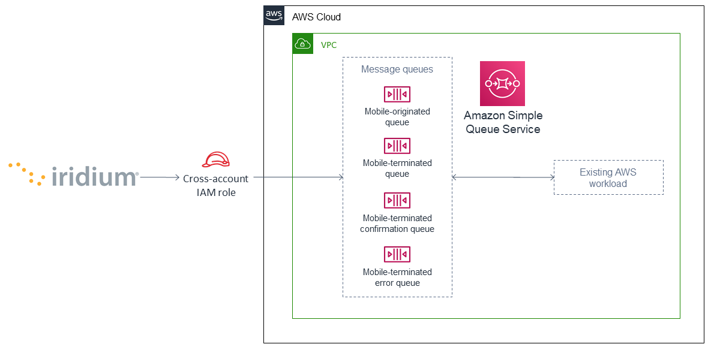
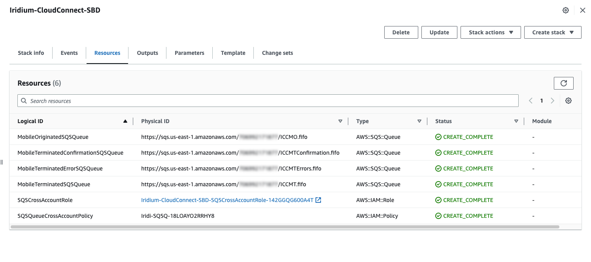

# Iridium CloudConnect for SBD on AWS - Getting Started Guide

## Overview

This guide covers the information you need to use Iridium CloudConnect for SBD solution in the AWS Cloud and an AWS CloudFormation template to deploy the infrastructure needed for the service to exchange messages with your AWS account.

The solution is for Iridium users who want to receive their SBD device data in Amazon Simple Queue Service (Amazon SQS) queues in JavaScript Object Notation (JSON) format.

This deployment guide assumes that you have some familiarity with Iridium Short Burst Data (SBD) devices and communications.

## Costs and licenses

There is no cost to use this guide, but you will be billed for any AWS services or resources that this guide deploys.

Iridium charges fees for messages, satellite network usage, and infrastructure setup, subject to applicable license agreements and terms and conditions with Iridium. Contact your Iridium representative, VAR, or service provider for details.

## Architecture


<sub><sup>Figure 1. Architecture for Iridium CloudConnect on AWS</sup></sub>

As shown in Figure 1, this guide deploys a CloudFormation template that sets up the following:

1. Amazon SQS to provide a highly available queueing service for Iridium SBD messages. This deployment configures the following queues:

- Mobile-originated
- Mobile-terminated
- Mobile-terminated confirmation
- Mobile-terminated error

2. An AWS Identity and Access Management (IAM) role and policy to set up Iridium CloudConnect cross-account authentication.

## Deployment

Deploy this AWS CloudFormation template in your account:

- [Iridium CloudConnecet for SBD - AWS CloudFormation Template](template/iridium-cloud-connect-sbd.template.yaml)

## Pre deployment steps

### Iridium partner or customer 

If you are not already an Iridium partner or customer, navigate to [Iridium](http://www.iridium.com) to learn more. Existing Iridium customers that are not direct Iridium Value-Added Retailers (VARs) should inquire with their service provider if Iridium CloudConnect is available. Iridium maintains a list of approved Iridium CloudConnect service providers. For more information, see [Who's My Service Provider?](https://www.iridium.com/who-is-my-sp/) on Iridium's website.

## Deployment steps

1. Sign in to your AWS account, open the AWS CloudFormation console and load the template located under the `template` folder of this guide.

2. Choose the correct AWS Region, and then choose **Next**.

3. On the Create stack page, keep the default setting and then choose Next.

4. On the Specify stack details page, change the stack name if needed. Review the parameters for the template. Provide values for the parameters that require input. For all other parameters, review the default settings and customize them as necessary. When you finish reviewing and customizing the parameters, choose Next.

5. On the Configure stack options page, you can specify tags (key-value pairs) for resources in your stack and set advanced options. When you finish, choose Next.

6. On the Review page, review and confirm the template settings. Under Capabilities, select all of the check boxes to acknowledge that the template creates AWS Identity and Access Management (IAM) resources that might require the ability to automatically expand macros.

7. Choose Create stack. The stack takes about 10 minutes to deploy.

8. Monitor the stack’s status, and when the status is `CREATE_COMPLETE`, the deployment is ready.

9. To view the created resources, choose the Outputs tab.


<sub><sup>Figure 2. Iridium CloudConnect outputs after successful deployment</sup></sub>

## Post deployment steps

### Interacting with your Amazon SQS queues

AWS provides several ways to interact with Iridium CloudConnect SBD queues, including:

- Via the command line, using the AWS Command Line Interface (AWS CLI).

- Manually, by navigating to Amazon SQS queues in the AWS Management Console.

- Programmatically, with many libraries available, such as: Boto3 for Python, AWS SDK for .NET, AWS SDK for Java and AWS SDK for Ruby

### Receiving mobile-originated messages

The recommended approach for receiving mobile-originated (MO) messages is to long-poll the ICCMO.fifo queue. After messages are received, save them in your database to process the messages, and then delete the messages.

**Note:** As a precaution in case of connectivity issues, Amazon SQS doesn’t automatically delete messages when they’re received. To delete a message, you must send a separate request after receiving it. For more information, see [Receiving and deleting messages (console)](https://docs.aws.amazon.com/AWSSimpleQueueService/latest/SQSDeveloperGuide/step-receive-delete-message.html).

```python
# Get the service resource
sqs = boto3.resource('sqs')

# Get the queue
queue = sqs.get_queue_by_name(QueueName='ICCMO.fifo')

# Process messages by printing out IMEI, location, and payload
for message in queue.receive_messages(WaitTimeSeconds=30):
  header = None
  location = None
  payload = None
  data = json.loads(message.body)

  for iei in data['data']:
    if data['iei_type'] == 'MO Header IEI':
      header = data
    elif data['iei_type'] == 'MO Location Information IEI':
      location = data
    elif data['iei_type'] == 'MO Payload IEI':
      payload = data

    # The message may contain location information
    if location is not None:
      print('IMEI {0} location is {1}'.format(
        header['imei'],
      location['latitude_longitude'] ))

    # The message may contain a payload
      if payload is not None:
      print('IMEI {0} payload of {1} bytes'.format(
        header['imei'],
        payload['mo_payload'] ))

# Let the queue know that the message is processed
message.delete()

```

### Sending mobile-terminated messages

Mobile-terminated messages (MT) are sent asynchronously. Therefore, when establishing a management process for MT messages, it is recommended that you break the process down into three separate procedures: sending, polling the confirmation message queue, and polling the error message queue.

#### Sending

When sending MT messages, uniquely identify each message with an integer, and then send the message to the ICCMT.fifo queue. For example:

```python
import boto3
import json
import uuid
# Get the service resource
sqs = boto3.resource('sqs')

# Get the queues
mt_queue = sqs.get_queue_by_name(QueueName = 'ICCMT.fifo')
message = "hello device".encode("utf-8").hex()

# Create a message
body = {
  "client_message_id": 123456789,
  "message": message,
  "imei": "432143214321432"
}

deduplication_id = str(uuid.uuid4())
group_id = str(uuid.uuid4())
mt_queue.send_message(
  MessageBody = json.dumps(body),
  MessageGroupId = group_id,
  MessageDeduplicationId = deduplication_id
)
```

#### Polling the confirmation message queue

When polling the ICCMTConfirmation.fifo queue for confirmation messages, process each confirmation message and then delete it. For example:

```python
# Get the service resource
sqs = boto3.resource('sqs') # Get the queues

mt_confirmation_queue = sqs.get_queue_by_name(QueueName='ICCMTConfirmation.fifo')

# Check the confirmation queue and, if no message found, check the error queue

for message in mt_confirmation_queue.receive_messages(WaitTimeSeconds=30):
  data = json.loads(message.body)

  # Status greater than zero indicates success
  if data['mt_message_status'] > 0:
    print("Message {0} is queued for delivery to IMEI {1} in position{2}".format(
      data['unique_client_message_id'],
      data['imei'],
      data['mt_message_status']))
  else:
    print("Message {0} was not sent to IMEI {0}".format(
      data['unique_client_message_id'],
      data['imei']))

# Let the queue know that the message is processed
message.delete()
Polling the error message queue
When polling the MTErrors.fifo queue for error messages, process each error message and then delete it. For example:

# Get the service resource
sqs = boto3.resource('sqs')

# Get the queues
mt_errors_queue = sqs.get_queue_by_name(QueueName='ICCMTErrors.fifo')

# Check the confirmation queue and, if no message found, check the errorqueue

for message in mt_errors_queue.receive_messages(WaitTimeSeconds=30):
  print(message.body)

# Let the queue know that the message is processed
message.delete()


```
#### Polling the error message queue

When polling the MTErrors.fifo queue for error messages, process each error message and then delete it. For example:

```python 
# Get the service resource
sqs = boto3.resource('sqs')

# Get the queues
mt_errors_queue = sqs.get_queue_by_name(QueueName='ICCMTErrors.fifo')

# Check the confirmation queue and, if no message found, check the errorqueue
for message in mt_errors_queue.receive_messages(WaitTimeSeconds=30):
  print(message.body)

# Let the queue know that the message is processed
message.delete()

```

### Provisioning

Devices must be provisioned using Iridium SPNet or Iridium Web Services (IWS). The provisioning address format is `address:port`, which corresponds to the customer origin and destination.


### Data format

When Iridium CloudConnect processes data from your device, it puts it in a JSON object that is exchanged between Amazon SQS and the Iridium gateway through Iridium CloudConnect. The JSON object contains information about the device, message payload, and header, in the following format:

```json
{
    "api_version": 1,
    "data": {
        "mo_header": {
            "cdr_reference": 1179650258,
            "session_status_int": 0,
            "session_status": "No error.",
            "momsn": 58939,
            "mtmsn": 0,
            "imei": "300334010407160",
            "time_of_session": "2019-12-16 15:04:09"
        },
        "location_information": {
            "cep_radius": 10,
            "latitude": "38.52137",
            "longitude": "-77.12970"
        },
        "payload": "746573746d756963"
    }
}

```

**Note:** For more information about message specifications, see the Iridium Short Burst Data Service Developers Guide.

#### Mobile-originated message formatting

Mobile-originated messages will be translated into the following JSON format:

```json
{
    "data": {
        "location_information": {
            "cep_radius": 2,
            "latitude": "33.20574",
            "longitude": "-111.50958"
        },
        "mo_header": {
            "cdr_reference": 1519223194,
            "imei": "3000010XXXXXXXX",
            "mtmsn": 0,
            "momsn": 64588,
            "session_status": "sbd_session_successful",
            "time_of_session": "2019-01-25 22:11:07"
        },
        "payload": "54657374696e67204d4f2054657874207769746820494343"
    },
    "api_version": 1
}
```

**Note:** For field details, see the following tables.

Top-level MO keys

| Field                 | Description |
| --------              | ------- |
| location_information  | Contains the latitude, longitude, and certainty radius.   |
| mo_header             | Contains metadata about the message including status and device ID.     |
| payload               | Contains the message payload. |
| api_version           | Notes the SBD API version. The SBD API version should always be 1.    |

Location information

|Field |Description |Type
| --------              | ------- | -------
|latitude |Contains the latitude of the device down to thousandths of a minute. |Floating point (thousandths of a minute)
|longitude |Contains the longitude of the device down to thousandths of a minute. |Floating point (thousandths of a minute)
|cep_radius |Provides an estimate of the Iridium Subscriber Unit's (ISU's) location accuracy. |Integer

MO Header

|Field |Description |Type
| --------              | ------- | -------
|cdr_reference |Call detail record, also known as auto ID. It's a unique identifier for a given message in the Iridium gateway database. |10-digit number
|imei |International Mobile Equipment Identity (IMEI), a unique equipment identifier also known as device ID. |15-digit number
|mtmsn |Mobile-terminated message sequence number (MTMSN) associated with the SBD session. This value is set by the Iridium gateway at the time that an MT message is queued for delivery. It is unique to each IMEI. It is then sent to the IMEI as part of the MT payload transfer. If an MT payload transfer is attempted, the MTMSN is included in the header regardless session's success. If the session fails, the payload still queues for delivery. If no MT delivery attempt is made in the session, this value is zero. |5- digit number
|momsn |Mobile-originated message sequence number (MOMSN) associated with the SBD session. This value is set by the IMEI and transmitted to the Iridium gateway as part of every SBD session. It is incremented by the IMEI after every successful session. |5-digit number
|session_status |An indication of success of the SBD session between the IMEI and the Iridium gateway associated with the over-the-air payload delivery. |String. (See the link:#_mo_session_status_values[MO session status values] table below.)
|time_of_session |Provides a UTC timestamp of the IMEI session between the IMEI and the Iridium Gateway. |Timestamp

MO session status values

|Status |Description |String
| --------              | ------- | -------
|0 |SBD session completed successfully. |sbd_session_successful
|1 |MO message transfer, if any, was successful. The MT message queued at the Iridium gateway is too large to be transferred within a single SBD session. |mt_message_too_large
|2 |MO message transfer, if any, was successful. The reported location is an unacceptable quality. This value is only applicable to IMEIs using SBD protocol revision 1. |unacceptable_quality
|10 |SBD session timed out before session completed. |session_timeout
|12 |MO message transferred by the IMEI is too large to be transferred within a single SBD session. |mo_message_too_large
|13 |RF link loss occurred during the SBD session. |rf_link_loss
|14 |IMEI protocol anomaly occurred during SBD session. |imei_anomaly
|15 |IMEI is prohibited from accessing the Iridium gateway. |imei_prohibited


#### Mobile-terminated message formatting

Use the following formatting to build mobile-terminated messages:

* Mobile-terminated message JSON

```
{
  "client_message_id" : "TEST",
  "message" : "5465737420484558206d657373616765",
  "imei" : "300125010001100",
  "flush_mt_queue" : false,
  "send_ring_alert_no_payload" : false,
  "message_priority" : 2,
  "assign_mtmsn" : false
}
```

* Bare minimum
```
{
  "client_message_id" : 1234,
  "message" : "68656c6c6f20776f726c64",
  "imei" : "300234087352917"
}
```
* With priority specified
```
{
  "client_message_id" : 9977331,
  "message" : "68656c6c6f20776f726c64",
  "imei" : "300234087352917",
  "message_priority" : 2
}
```

* All possible options

```
{
  "client_message_id" : 789012,
  "message" : "68656c6c6f20776f726c64",
  "imei" : "300234087352917",
  "flush_mt_queue" : false,
  "send_ring_alert_no_payload" : false,
  "message_priority" : 3,
  "assign_mtmsn" : false
}
```
**NOTE:** For more information about allowed combinations, see the Iridium Short Burst Data Service Developers Guide.

Top-level MT keys

|Field |Description |Type
| --------              | ------- | -------
|client_message_id |Unique identifier for client messages. |Number or 4-character string
|message |Payload of the MT message. |String
|imei |Unique equipment identifier of the device that receives an MT message. |15-digit number
|flush_mt_queue | When this flag is set to `true`, all payloads in the MT queue for the given IMEI are deleted. This provides an integrated method to administer MT queues. When an MT message includes a payload, it is queued after the currently queued payloads, if any, are deleted. This enables the vendor application to maintain a queue depth of one, overwriting any previously queued payloads. |Boolean (true, false)
|send_ring_alert_no_payload |When this flag is set to `true`, the Iridium gateway sends an SBD ring alert to the specified IMEI, even though no new MT payload is queued. |Boolean (true, false)
|message_priority |Priority level of the MT message. The associated MT payload will be placed in the queue according to priority level. | Number (1 to 5)
|assign_mtmsn |When this flag is set to `true`, the Generic Security Standard (GSS) API uses the value in the Unique ID field in the message header as the MTMSN for the associated MT message payload. |Boolean (true, false)


MT confirmation message formatting

```
{
  "mt_message_id": 1234512345,
  "unique_client_message_id": 1234,
  "imei": 123451234512345,
  "auto_id_reference": 5432154321,
  "mt_message_status": -2
}
```

Keys


|Field |Description
| --------              | -------
|mt_message_id |Identifier of the message in the Iridium CloudConnect database.
|unique_client_message_id |Customer-supplied identifier for the message.
|imei |Unique equipment identifier of the device that will receive an MT message.
|auto_id_reference |Unique identifier in the Iridium gateway database.
|mt_message_status |Number. (See link:#_mt_confirmation_status_values[MT confirmation status values] table.)

MT confirmation status values

|Status |Description
| --------              | -------
|1-50 |Order in the MT message queue of the successfully received payload. 
|0 |Message with a zero-byte payload received successfully (i.e., a mailbox check).
|-1 |IMEI has too few characters, non-numeric characters.
|-2 |Unknown IMEI – is not provisioned on the Iridium gateway.
|-3 |Payload size exceeds the maximum allowed.
|-4 |No payload received.
|-5 |MT message queue is full (maximum of 50).
|-6 |MT resources are unavailable.
|-7 |Violation of MT DirectIP protocol error.
|-8 |Ring alerts to the given IMEI are disabled.
|-9 |IMEI is not attached (i.e., not set to receive ring alerts).
|-10 |Source IP address was rejected by MT filter.
|-11 |MTMSN value is out of range (valid range is 1-65,535).

NOTE: For transceiver message sizes and other specifications, Iridium Short Burst Data Service Developers Guide.

## Troubleshooting

### FAQ

**Q. I already use DirectIP service to send and receive Iridium messages. How do I get access to Iridium CloudConnect?**

A. Partners can explore Iridium CloudConnect regardless of their existing connection method to Iridium SBD. Contact your Iridium channel manager for a technical brief tailored to your specific configuration.

**Q. How do I get started with an Iridium CloudConnect development environment?**

A. Most Iridium customers set up two Iridium CloudConnect instances, one for their development environments and another for their production system. This aligns with the way Iridium customers traditionally set up DirectIP deployments. Also, you can route messages using your traditional method and through Iridium CloudConnect, and use comparative testing to verify Iridium CloudConnect operations and utility.

**Q. What is the pricing for Iridium CloudConnect? Who pays for the AWS compute resources?**

A. Iridium does not assess a charge for sending messages through Iridium CloudConnect instead of another method such as DirectIP. Iridium, however, prefers that customers use Iridium CloudConnect for development and production environments. As such, Iridium may direct customers away from using SMTP (e-mail) for message exchange to the SBD gateway for production environment activity.

**Q. How do you ensure message ordering? Do you use Amazon SQS FIFO (First-In-First-Out)?.**

A. Iridium processes messages from the SBD gateway in order of receipt but does not specifically use an AWS Lambda instance to do this. During the setup of Iridium CloudConnect, customers can choose FIFO or non-FIFO configurations. FIFO queues keep messages in order.

# Customer responsibility

After you deploy this solution, confirm that your resources and services are updated and configured—including any required patches—to meet your security and other needs. For more information, refer to the [Shared Responsibility Model](https://aws.amazon.com/compliance/shared-responsibility-model).

## Feedback

To submit feature ideas and report bugs, use the Issues section of the GitHub repository.

## Notices

This document is provided for informational purposes only. It represents current AWS product offerings and practices as of the date of issue of this document, which are subject to change without notice. Customers are responsible for making their own independent assessment of the information in this document and any use of AWS products or services, each of which is provided "as is" without warranty of any kind, whether expressed or implied. This document does not create any warranties, representations, contractual commitments, conditions, or assurances from AWS, its affiliates, suppliers, or licensors. The responsibilities and liabilities of AWS to its customers are controlled by AWS agreements, and this document is not part of, nor does it modify, any agreement between AWS and its customers.